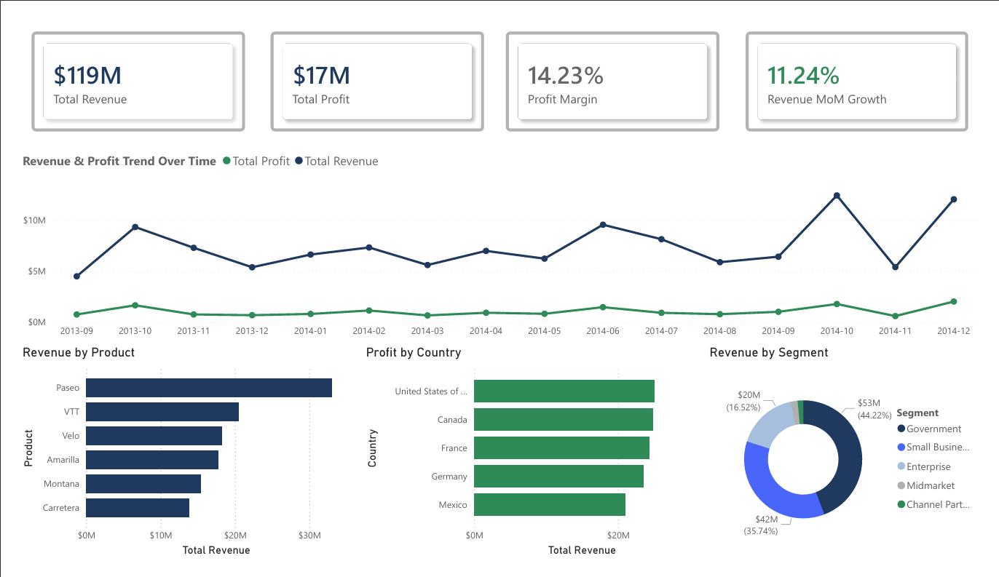

# Financial Performance Dashboard (Power BI)

## Overview
This project analyzes financial performance using Power BI, focusing on revenue, profitability, and growth trends across products, regions, and customer segments.

## Dashboard Preview

## Key Metrics
- Total Revenue: $119M  
- Total Profit: $17M  
- Profit Margin: 14.23%  
- MoM Revenue Growth: 11.24%  

## Key Insights
- Government segment contributes ~44% of total revenue, making it the dominant revenue driver  
- Revenue shows a clear upward trend toward late 2014, indicating seasonal growth patterns  
- Paseo is the top-performing product, significantly outperforming other product categories  
- North America generates the highest profit contribution across regions  

## Features
- Interactive dashboard with slicers and filters  
- Dynamic KPI indicators with conditional formatting  
- Time-series analysis for revenue and profit trends  
- Segmentation analysis by product, country, and customer segment  

## Tools & Skills
- Power BI  
- DAX  
- Data Modeling  
- Financial Analysis  

## Files
- Power BI report (.pbix)  
- Dataset (Excel)  
- Dashboard screenshot  
